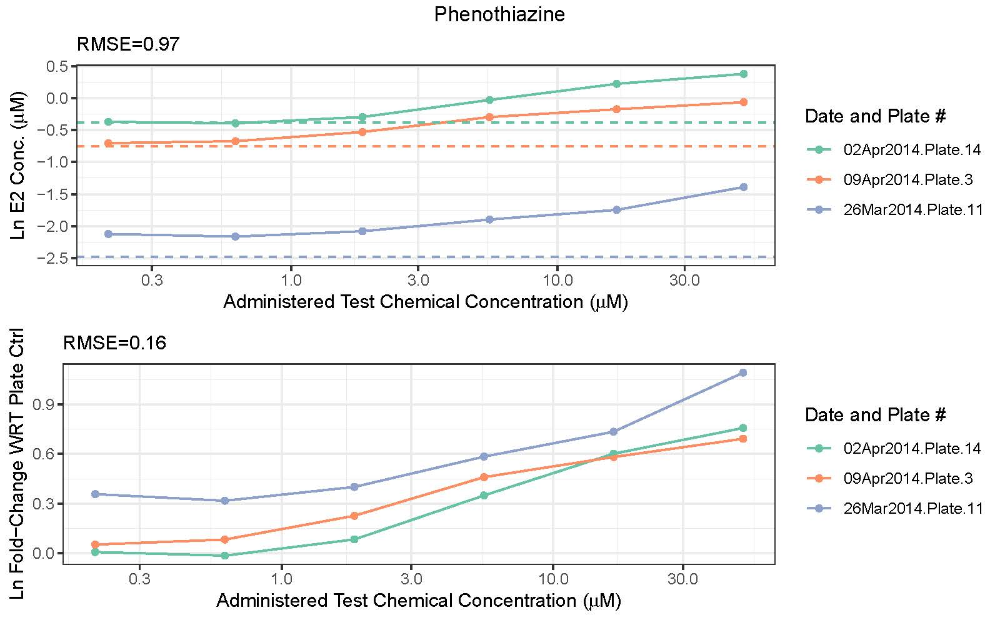

# This is a comprehensive response to Burgoon and Borgert [add link] and an abbreviated response is published in EHP [citation info and link].

 

## Response to Burgoon and Borgert’s (2022) Comment on “Application of an in Vitro Assay to Identify Chemicals That Increase Estradiol and Progesterone Synthesis and Are Potential Breast Cancer Risk Factors” 

In our recent analysis of the US Environmental Protection Agency’s (EPA) data from the high-throughput (HT) H295R screening of 656 chemicals in concentration-response (CR) (Cardona and Rudel 2021) we carefully considered concerns about false negatives and false positives. Considering points raised by Burgoon and Borgert, we further analyzed this issue, and we disagree with their assertion that the 296 chemicals we found to increase estradiol (E2) and progesterone (P4) in the HT-H295R assay are mostly false positives. We provide here additional information that supports our assessment that these chemicals should be further evaluated for effects on breast cancer.   

In order to reach their conclusion about false positives, Burgoon and Borgert made two decisions that are inconsistent with standard approaches. First, they did not normalize hormone concentration changes from treatment to concurrent plate-specific controls. Instead, they combined responses from DMSO controls run over a three-year period (2013-2015) during which 576 chemicals were tested in CR to create a distribution of control values, and then they looked for signals from chemical treatment to be significantly different from that distribution. (Note also that they also did not include data for 84 chemicals tested in 2017 (Haggard et al. 2018), which we did include, for a total of 656 unique chemicals.) Burgoon’s approach is inconsistent with generally accepted practice for experimental science in general; it is specifically inconsistent with standard analyses for this assay as specified in the Organization for Economic Co-operation and Development (OECD) and EPA’s Endocrine Disruptor Screening Program (EDSP) steroidogenesis test guidelines (EPA 2011; OECD 2011); and it is inconsistent with both of EPA’s approaches to analyzing these data, either using their tcpl automated pipeline (Filer et al. 2017; Karmaus et al. 2016) or the more specific ANOVA-based approach that we drew on (Haggard et al. 2018).  

Second, Burgoon applied an arbitrary biological constraint within their data analysis, requiring a hormone concentration to increase above a threshold that they selected for the response to be positive. 

Neither the pooling of controls nor the application of a hormone concentration threshold are disclosed in their letter, but they are described in their GitHub code (https://github.com/DataSciBurgoon/toxcast_steroidogenesis/).  

We provide additional detail about these and several other points from their letter below, and details of our work can be found in our GitHub files (https://github.com/SilentSpringInstitute/E2upP4up_followup_Burgoon).  

### <i> Normalize to concurrent controls </i>

It is difficult to understand Burgoon’s rationale for rejecting normalization of hormone concentrations after treatment to concurrent controls. Pooling all raw control data from all plates run in 2013 through 2015, in which the EPA screened 576 chemicals in CR, dramatically overstates variability, increasing noise and reducing the ability to detect a signal in results. Well-designed experiments seek to maximize signal-to-noise and maintain sensitivity in the face of experimental variability by comparing against concurrent controls. Indeed, as mentioned above, the method Burgoon and Borgert employ is inconsistent with OECD and EPA approaches (EPA 2011; Haggard et al. 2018; Karmaus et al. 2016; OECD 2011) for the low-throughout and high-throughput H295R steroidogenesis assay, which normalizes hormone increases produced by test chemicals against DMSO controls on a per-plate basis by calculating the fold-change. Our analysis drew on EPA’s methods (Haggard et al. 2018; Karmaus et al. 2016) which normalized to concurrent controls, as is standard practice.  

To provide additional evidence for the importance of normalizing data to concurrent controls, we compared the results for chemicals that we identified as increasing E2 (N = 28) run in replicate plates on separate days (https://github.com/SilentSpringInstitute/E2upP4up_followup_Burgoon/blob/main/DMSO_control.html, Figure 1). This analysis shows that normalizing E2 results for test chemicals to concurrent controls leads to more consistent results across replicates (see example in Figure 1), as evidenced by the reduction in root mean squared error (RMSE; a measure of differences between replicate data points) for 22/28 chemicals run in replicate plates. In other words, while the absolute hormone concentrations from control and test wells can differ between replicate plates, the dose-response curves become more consistent when normalized to concurrent controls. For the six chemicals where RMSE was not reduced by normalizing to concurrent controls, three had very close RMSEs before and after normalization (ametryn, 0.29 vs. 0.31; CI-1044, 0.21 vs. 0.28; deisopropylatrazine, 0.22 vs. 0.25) and very similar concurrent control values. The other three chemicals with increased RMSEs were estrogens (17alpha estradiol, 17beta estradiol, and estrone) that we had excluded from our analysis, as we noted in our publication, because they are components of the metabolic pathway and may interfere with measurements of de novo hormone synthesis.

### <i>Threshold response for actives</i>
Burgoon and Borgert set a threshold that, to be considered a “true endocrine response” and warrant a positive hit-call, the test chemical had to increase E2 by 0.2μg/L over the DMSO control baseline, based on their assessment that this is the blood serum concentration at which E2 stimulates ovulation. It is not clear why Burgoon thought that an additional threshold for response was needed beyond the statistically significant increase in E2 synthesis, and this threshold is not supported by the literature.  
Specifically:
- No threshold is expected for this pathway. The biological significance of this assay, and the reason we highlighted these chemicals for potentially increasing breast cancer risk, is that these chemicals can significantly increase biosynthesis of hormones above baseline. Since hormones are naturally produced with an evolutionarily optimized balance, any perturbation to normal hormonal signaling presents a risk for adverse effects, especially during development and in populations with a wide range of background susceptibilities. 
- Additive effects from mixtures are expected. People are exposed to chemicals in a wide range of concentrations, with different frequencies, and in different combinations. Mixtures can produce additive effects, and chemicals applied at doses below which they produce effects in isolation can elicit effects when applied in combination (Council 2008; Howdeshell et al. 2015; Howdeshell et al. 2017; Kortenkamp 2020; Martin et al. 2021). 
- Applying a threshold for increased E2 in this in vitro assay is also not meaningful because the concentration of a hormone in the media of a test well culture of a single cell line (transformed adrenal) is unlikely to be the same as the concentration that would be circulating in serum or present in local tissues in vivo. It is unknown whether the H295R assay quantitatively predicts the levels of hormones at any site in the body. The utility of the H295R assay is that it demonstrates chemicals’ abilities to perturb enzymatic and signaling pathways involved in hormone production. As we noted in our original article, further research is needed to measure in vivo E2 production and downstream effects in diverse tissues following exposure to these E2-up chemicals, because E2 production is locally controlled in some peripheral tissues, including the breast (Simpson et al. 2005).
- Burgoon’s proposal that an increase in E2 by 0.2 μg/L (or 200 pg/mL, which they state achieves 93-97% receptor occupancy) is the minimum to be biologically significant is incorrect. For example, in children before puberty, serum E2 levels are less than 20 pg/mL; levels in adult men are generally expected to be less than 40 pg/mL; and aromatase inhibitor treatment for breast cancer reduces levels in postmenopausal women from 10-15 pg/mL to 1 pg/mL or less (Carmina et al. 2019). In experimental studies, even very low concentrations of E2 (e.g., 0.01 pM = 2.7 fg/mL) induce cell proliferation in sensitive cells with just 0.1% estrogen receptor occupancy (Chun et al. 1998). 

Many questions remain about what effects might be expected from heightened E2 synthesis in humans, especially during development and especially in the breast, and these are priorities for future research. Along those lines, we have documented in this paper and others (Cardona and Rudel 2020, 2021; Makris 2011; Rudel et al. 2011; Tucker et al. 2018) that current toxicology testing approaches do not sufficiently assess the biological consequences from altered steroidogenesis through downstream effects on the breast and other endocrine-sensitive tissues. It is critical to strengthen in vivo and in vitro protocols to capture effects from these pathways because they are critical in human development and disease.  

### <i>How we approached potential false positives and negatives</i>
As described in our paper (Cardona and Rudel 2021), we took several measures to optimize the balance between Type I (false positive) and Type 2 (false negative) errors. The approaches we used rely heavily on EPA’s analysis of these same H295R data (Haggard et al. 2018), and are consistent with OECD and EPA test guidelines as well (EPA 2011; OECD 2011). E2 and P4-up chemicals were first selected based on significantly increasing these hormones by OECD criteria (two consecutive concentrations and/or maximum non-cytotoxic concentration significantly different from control by ANOVA), as reported in Haggard 2018. Then, to minimize false positives, our list of active E2-up (n=182) and P4-up (n=185) chemicals had to meet three additional criteria – they had to produce a hormone response with a fold-change ≥ 1.5, and had to significantly perturb multiple components of the steroidogenesis pathway based on the calculated adjusted maximal mean Mahalanobis distance (adj.maxmMd > 0). The calculations for the adj.maxmMd were conducted by US EPA and are published in (Haggard et al. 2018). We applied a third criterion for potency so that we only considered the most potent chemicals (lowest effective concentration ≤ 33 μM) as active. In addition to finding 182 E2-up and 185 P4-up chemicals that meet these criteria, we also identified another set of chemicals, including 84 E2-up and 90 P4-up, as borderline-actives because they significantly increased E2 and P4 using the ANOVA-based method but did not meet the additional three criteria above. These are more likely to include some false positives, but there may be some true positives among them as well. Further support for these chemicals being true positives comes from studies in rodents. Forty-five chemicals tested in Haggard have also been shown to have carcinogenic or developmental effects in the rodent mammary gland; 29 of these increased E2 and/or P4, and an additional 6 were borderline-active (Cardona and Rudel 2021).  

We also want to correct Burgoon’s mis-calculation of the fraction of positives among all the chemicals screened with two points. First, Burgoon excluded 84 chemicals tested in 2017, which we included, inflating the fraction positive. Additionally, note that over 2,012 chemicals were initially tested at a single dose in HT-H295R, and 656 were selected for subsequent testing in CR format because they affected multiple hormones (suggesting perturbation of the pathway rather than single hormone changes that could be false-positives). Thus, the 296 positive chemicals we identified as active are derived from screening these 2,012 chemicals, yielding 9% E2-up and 9.3% P4-up. 

### <i>Analysis of replicates</i>
Analysis of the 107 chemicals (16% of the 656 total) tested in replicate provides an indication of reproducibility of the data. For efficiency and consistency in our original analysis, we randomly used the data from the first block tested and discarded subsequent data from replicates. In response to comments from Burgoon, we analyzed concordance of replicates tested in multiple blocks using data from Haggard (2018) and excluding hormone substrates. Among the 107 chemicals tested more than once, we determined that 62% (66/107) and 74% (69/107) did not increase E2 and P4, respectively. Of the chemicals we identified as active (based on their first test), we found that a majority of replicates were concordant at subsequent tests, with 52% (12/23) of E2-up chemicals and 86% (18/21) of P4-up chemicals having concordant positive results. Among the chemicals we classified as borderline-active (i.e., significant increase in E2/P4 by ANOVA but did not meet our additional criteria) that were run in replicate, 2/15 (13%) increased E2 and 11/16 (69%) increased P4 by ANOVA in replicate assays, consistent with borderline chemicals being closer to the “noise” of the assay. Lower concordance among E2-up chemicals is consistent with the overall lower dynamic range of E2 concentration changes in the assay, as we discussed in our paper. Seven chemicals tested multiple times were not positive by ANOVA for E2-up in the first run but were positive in a later run, so these may have been potential false negatives in our E2-up analysis.   

Lower reproducibility for E2-up chemicals raises questions about the reliability of the positive and negative findings, however, our paper also showed evidence of related in vivo effects in E2-up chemicals using several different approaches. First, based on literature review, many of the ten most potent and efficacious E2-up chemicals have in vivo evidence of increased hormone concentrations, mammary gland effects including tumors, and other reproductive and developmental toxicity, although three that are pesticides lack publicly available studies to review (Table 2 in Cardona and Rudel 2021). In addition, as noted above, 45 chemicals tested in Haggard have also been shown to have carcinogenic or developmental effects in the rodent mammary gland, and 23 of these specifically increased E2 (20 active and 3  borderline-active) (Cardona and Rudel 2021).   

Overall reproducibility among replicates—especially for P4—adds to evidence that the data are reliable and that normalization to concurrent controls, standard practice in this field, provides consistent and robust results. Lower dynamic range and lower concordance among replicates in the E2-up outcome suggests an opportunity to strengthen methods for detecting effects on E2 steroidogenesis, since this is an important outcome measure.  

### <i>Sample size</i>
While it is true most chemicals have a small sampling size in relying on duplicates instead of triplicates (as is the case in OECD and EDSP guidelines), this is by design since the H295R assay was adapted to high-throughput. To improve confidence in results from duplicates, Haggard (2018) conducted tests against OECD reference chemical interlaboratory results and found good reproducibility for both E2 and testosterone responses (Haggard et al. 2018). For increased E2, the HT-H295R assay shows a sensitivity of 0.75, a specificity of 0.85, and an accuracy of 0.81 (Haggard et al. 2018). Progesterone was not validated externally since the OECD H295R assay only measures E2 and testosterone, but based on our analysis of the replicates from separate plates (discussed above), progesterone shows a good concordance in hit-calls. 

### <i>Source of the data</i>
Burgoon and Borgert write that we did not base our analysis on the US EPA’s ToxCast Database (invitroDB3.3), but this is incorrect. We used the raw data from the ToxCast Database, however, as we make clear in our paper, we chose to use the ANOVA-based method described in Haggard 2018 to determine the chemical-hormone pair significance (i.e., the hit-call) instead of using the ToxCast automatic data processing pipeline (tcpl). We did this because the tcpl is usually applied to all ToxCast data to standardize it with other HT data and to provide a preliminary overview, with the expectation for subsequent analyses to improve interpretation. The ANOVA-based approach was validated for this type of assay in the OECD test guideline 456 (Hecker et al. 2011; OECD 2011). Importantly, the tcpl uses the lower chemical doses to estimate a baseline response, whereas ANOVA compares responses at each dose to the control. The ANOVA-based approach is thus able to detect effects at the two lower doses, making it less prone to false-negatives, because it treats all chemical doses as test wells rather than effectively as controls. Although we did not use the tcpl method, we found a high correlation between ToxCast tcpl hit-calls for E2 and P4 increases and the ANOVA-based analysis we used (see supplemental figure 1 in Cardona and Rudel 2021). 

### <i>Data quality flags</i>
Burgoon and Borgert state that we did not consider quality flags in the National Toxicology Program’s Integrated Chemical Environment (ICE) database for 37 chemicals that increase E2 and 42 chemicals that increase P4. However, after mapping the chemicals we identified as increasing E2 or P4 onto ICE data (https://ice.ntp.niehs.nih.gov/downloads/DataonICE/cHTS2021_invitrodb33_20210128.zip) and filtering for the HT-H295R assay, we instead found quality control (QC) flags for 22 chemicals (13 that increased E2, 4 that increased P4, and 5 that increased both). It is possible that Burgoon and Borgert did not filter for QC flags for chemicals in the HT-H295R assay run in CR in particular.  
Chemicals with a QC flag do not necessarily need to be dismissed for the analysis. ICE used QC information available on the Tox21 tripod (https://tripod.nih.gov/tox21/samples). We mapped the E2-up and P4-up on this database and identified three chemicals (retinol acetate, 5-chloro-2-methyl-3(2H)-isothiazolone and dicyclohexylamine) with a caution flag that suggests the named chemical was not detected during the QC. These results may reflect activity of a different chemical that was tested but mislabeled, or some other experimental issue. For the rest of the QC flagged chemicals, typically the QC flag warns of lower than expected concentration of the test chemical in the well.  For these, low concentration is less likely to produce a detectable positive response, leading to false negatives. However, positive results for these suggest the chemical is active and are informative at least qualitatively. These chemicals may be more potently steroidogenic than we originally indicated.  
Finally, it is important to note that ICE uses the tcpl pipeline to determine some QC criteria. The data that we used—from Haggard (2018)—relied on another approach based on ANOVA. QC from ICE may not be fully applicable for this assay. 

### <i>The quality of the progesterone data</i>
It is unclear why Burgoon and Borgert highlight “day-effects” only for P4 data and suggest that this is grounds for dismissing the P4 results entirely. Differences related to running plates on different days would typically apply to all measurements from those plates, and indeed, this is why DMSO control wells are included on every plate: to account for variability between measurements from different plates. Good concordance between replicates for P4, discussed above, suggest that this is not a major concern, and P4 results are even more reliable than those for E2. 

### <i>Final Thoughts</i>
One of the authors of the critique—C. Borgert – previously asserted that synthetic estrogenic chemicals are not potent enough to be of health concern compared to natural compounds with comparable endocrine activity (Autrup et al. 2020), a viewpoint that ignores concerns raised by the Endocrine Society and others about ligand-, tissue-, and life stage-specific effects (Gore et al. 2015). The chemicals we have identified in this analysis stimulate production of endogenous hormones, which are especially potent, so this raises additional concerns about health effects. Borgert’s conflict of interest disclosure notes that he has worked for the regulated chemical industry on endocrine disruptor issues, so readers should be aware that Burgoon and Borgert’s critique may be part of a strategy to create doubt and skepticism (Michaels 2020).  
Estradiol and progesterone play a critical role in the progression of many breast cancers and likely influence other endpoints such as lactation and breast development, so it is an urgent priority to identify chemicals that may increase risk by affecting steroidogenesis. We hope our work will contribute to identifying opportunities to prevent breast cancers by understanding and reducing these exposures.
 

<i><b>Figure 1:</b> Phenothiazine replicate results before and after normalization to concurrent controls. Each color represents an experiment run on different dates and plates. In the top graph, the solid line represents the plate-specific mean (of technical duplicates) hormone concentrations after test chemical administration, and the dashed line represents the plate-specific DMSO baseline (y-intercept). In the bottom graph, the data have been normalized so that the Y-axis shows log fold-change (ln([E2]test) – ln([E2]control)). Normalizing hormone data to concurrent controls decreases experimental variability as seen by the reduced root mean squared error (RMSE) from 0.97 (top graph) to 0.16 (bottom graph).</i> 

Similar graphs for replicates of E2 and P4 data can be found in our GitHub files (https://github.com/SilentSpringInstitute/E2upP4up_followup_Burgoon) 

### <u><b>Acknowledgements:</u></b>
We appreciate support from Drs. R.W. Setzer (emeritus US EPA) and K. Paul-Friedman (US EPA) in preparing this response.

### <u><b>Conflicts/Funding:</u></b>
This work was funded by the by the U.S. National Institutes of Health/National Institute of Environmental Health Sciences Breast Cancer and Environment Research Program (U01ES026130), the California Breast Cancer Research Program (awards 21UB-8012 and 21UB-8100), the Cedar Tree Foundation, and charitable gifts to the Silent Spring Institute. All authors are or have been employed at the Silent Spring Institute, a scientific research organization dedicated to studying environmental factors in women’s health. The institute is a 501(c)3 public charity funded by federal grants and contracts, foundation grants, and private donations, including from breast cancer organizations. Study funders had no role in study design; in the collection, analysis and interpretation of data; in the writing of the report; and in the decision to submit the article for publication. 

<b>Signature block</b> 
Ruthann A. Rudel* 
Bethsaida Cardona 
Alexandre Borrel 
Jennifer E. Kay 
Silent Spring Institute, 320 Nevada St. Newton, MA 02460 
*Corresponding author, Rudel@SilentSpring.org 

 

### <b>References</b>
- Autrup H, Barile FA, Berry SC, Blaauboer BJ, Boobis A, Bolt H, et al. 2020. Human exposure to synthetic endocrine disrupting chemicals (s-edcs) is generally negligible as compared to natural compounds with higher or comparable endocrine activity. How to evaluate the risk of the s-edcs? J Toxicol Environ Health A 83:485-494.
- Cardona B, Rudel RA. 2020. Us epa's regulatory pesticide evaluations need clearer guidelines for considering mammary gland tumors and other mammary gland effects. Mol Cell Endocrinol:110927.
- Cardona B, Rudel RA. 2021. Application of an in vitro assay to identify chemicals that increase estradiol and progesterone synthesis and are potential breast cancer risk factors. Environ Health Perspect 129:77003.
- Carmina E, Stanczyk FZ, Lobo RA. 2019. Chapter 34 - evaluation of hormonal status. In: Yen and jaffe's reproductive endocrinology (eighth edition),  (Strauss JF, Barbieri RL, eds). Philadelphia:Elsevier, 887-915.e884.
- Chun TY, Gregg D, Sarkar DK, Gorski J. 1998. Differential regulation by estrogens of growth and prolactin synthesis in pituitary cells suggests that only a small pool of estrogen receptors is required for growth. Proc Natl Acad Sci U S A 95:2325-2330.
- Council NR. 2008. Phthalates and cumulative risk assessment: The tasks ahead. Washington, DC:The National Academies Press.
- EPA U. 2011. Steroidogenesis (human cell line - h295r) ocspp guideline 890.1550. (Standard Evaluation Procedure). Washington, DC:US EPA 
- Filer DL, Kothiya P, Setzer RW, Judson RS, Martin MT. 2017. Tcpl: The toxcast pipeline for high-throughput screening data. Bioinformatics 33:618-620.
- Gore AC, Chappell VA, Fenton SE, Flaws JA, Nadal A, Prins GS, et al. 2015. Edc-2: The endocrine society's second scientific statement on endocrine-disrupting chemicals. Endocrine Reviews 36:E1-E150.
- Haggard DE, Karmaus AL, Martin MT, Judson RS, Setzer RW, Paul Friedman K. 2018. High-throughput h295r steroidogenesis assay: Utility as an alternative and a statistical approach to characterize effects on steroidogenesis. Toxicol Sci 162:509-534.
- Hecker M, Hollert H, Cooper R, Vinggaard AM, Akahori Y, Murphy M, et al. 2011. The oecd validation program of the h295r steroidogenesis assay: Phase 3. Final inter-laboratory validation study. Environ Sci Pollut Res Int 18:503-515.
- Howdeshell KL, Rider CV, Wilson VS, Furr JR, Lambright CR, Gray LE, Jr. 2015. Dose addition models based on biologically relevant reductions in fetal testosterone accurately predict postnatal reproductive tract alterations by a phthalate mixture in rats. Toxicol Sci 148:488-502.
- Howdeshell KL, Hotchkiss AK, Gray LE, Jr. 2017. Cumulative effects of antiandrogenic chemical mixtures and their relevance to human health risk assessment. Int J Hyg Environ Health 220:179-188.
- Karmaus AL, Toole CM, Filer DL, Lewis KC, Martin MT. 2016. High-throughput screening of chemical effects on steroidogenesis using h295r human adrenocortical carcinoma cells. Toxicol Sci 150:323-332.
- Kortenkamp A. 2020. Which chemicals should be grouped together for mixture risk assessments of male reproductive disorders? Mol Cell Endocrinol 499:110581.
- Makris SL. 2011. Current assessment of the effects of environmental chemicals on the mammary gland in guideline rodent studies by the u.S. Environmental protection agency (u.S. Epa), organisation for economic co-operation and development (oecd), and national toxicology program (ntp). Environmental health perspectives 119:1047-1052.
- Martin O, Scholze M, Ermler S, McPhie J, Bopp SK, Kienzler A, et al. 2021. Ten years of research on synergisms and antagonisms in chemical mixtures: A systematic review and quantitative reappraisal of mixture studies. Environ Int 146:106206.
- Michaels D. 2020. The triumph of doubt: Dark money and the science of deception:Oxford University Press.
- OECD. 2011. Test no. 456: H295r steroidogenesis assay.
- Rudel RA, Fenton SE, Ackerman JM, Euling SY, Makris SL. 2011. Environmental exposures and mammary gland development: State of the science, public health implications, and research recommendations. Environmental health perspectives 119:1053-1061.
- Simpson ER, Misso M, Hewitt KN, Hill RA, Boon WC, Jones ME, et al. 2005. Estrogen--the good, the bad, and the unexpected. Endocr Rev 26:322-330.
- Tucker DK, Hayes Bouknight S, Brar SS, Kissling GE, Fenton SE. 2018. Evaluation of prenatal exposure to bisphenol analogues on development and long-term health of the mammary gland in female mice. Environ Health Perspect 126:087003.

